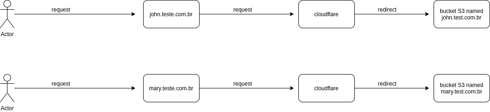

About the project:
================================================================

- This project is one poc(PROOF OF CONCEPT) where I testing one solution where to the run script occur follow steps: create site, put site in s3, hosted static website the person using s3 and setting domain in cloudflare to forward to specific s3 bucket.

Architecture:
===============

Technologies used:
===================

- Node.js
- Javascript
- Cloudflare(CDN)
- S3(host static website)
